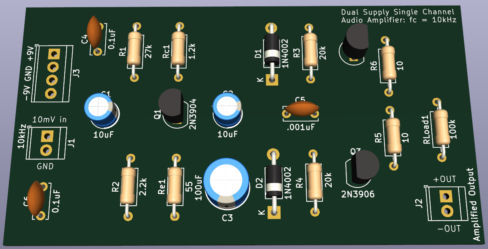
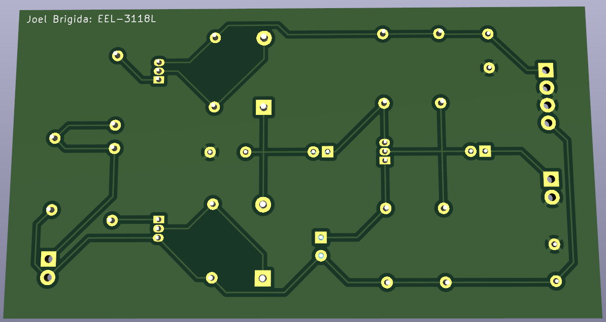

# Audio Amplifier from EEL3118L:

This is a project for Electronics 1 Lab. This is a Dual Power Supply Complementary Audio Amplifier built and 
rendered using KiCad. This design was tested and working using the Digilent Analog Discovery 2. The center frequency for this amplifier is 10kHz.

## Schematic & PCB Layouts:

<small>
    Schematic for Audio Amp 
</small>

 

<small>
    PCB View for Audio Amp 
</small>

 

## 3D Renderings:

<small>
    Top of PCB Design 
</small>

 

<small>
    Bottom of PCB Design 
</small>

