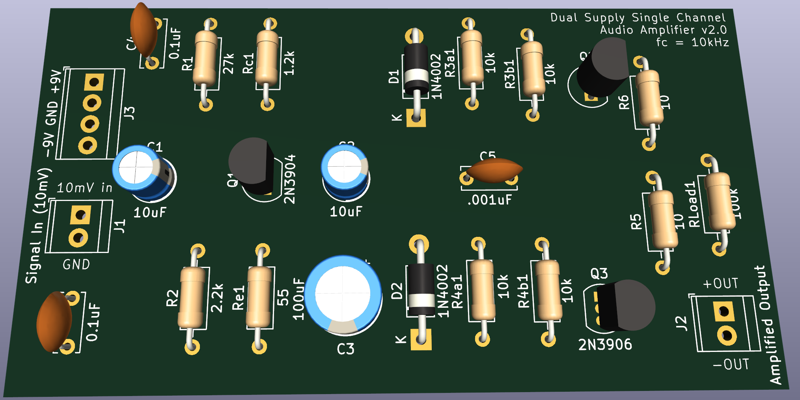
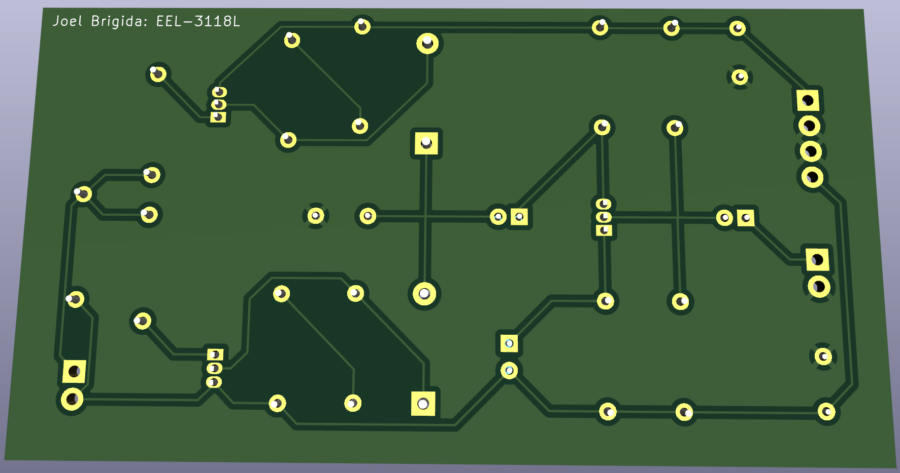

# Audio Amplifier from EEL3118L v2.0:

This is a small redesign of the Dual Power Supply Complementary Audio Amplifier project for Electronics 1 Lab. 
This design uses all 1% resistors, so the $ 20k\Omega \, R_3 $ and $ R_4 $ had to be replaced with $ 2\times 
10k\Omega $ Resistors in series. This design was tested and working using the Digilent Analog Discovery 2. The 
center frequency for this amplifier is still 10kHz.

## Schematic & PCB Layouts:

<small>
    Schematic for Audio Amp 
</small>

 

<small>
    PCB View for Audio Amp 
</small>

 

## 3D Renderings:

<small>
    Top of PCB Design 
</small>

 

<small>
    Bottom of PCB Design 
</small>

