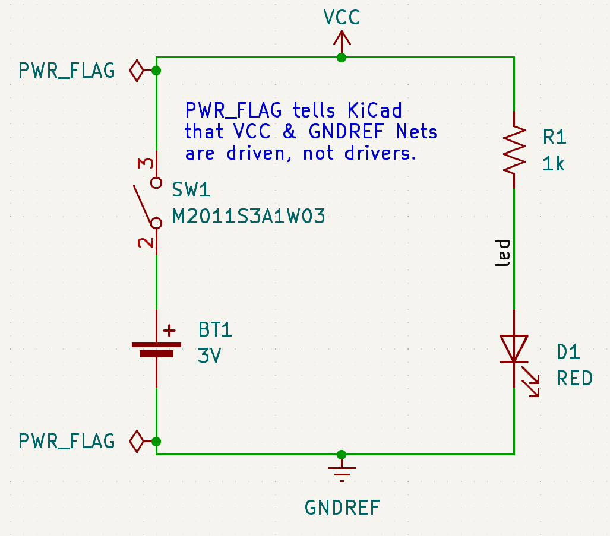
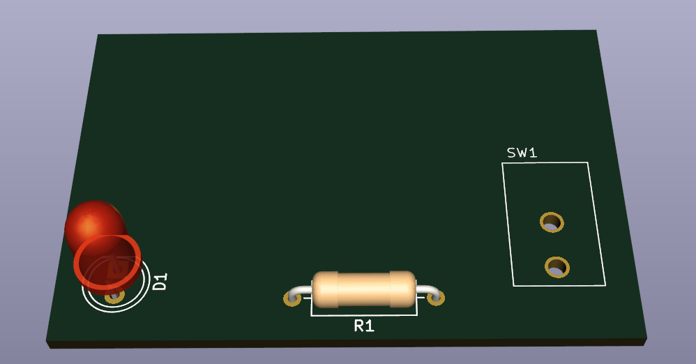
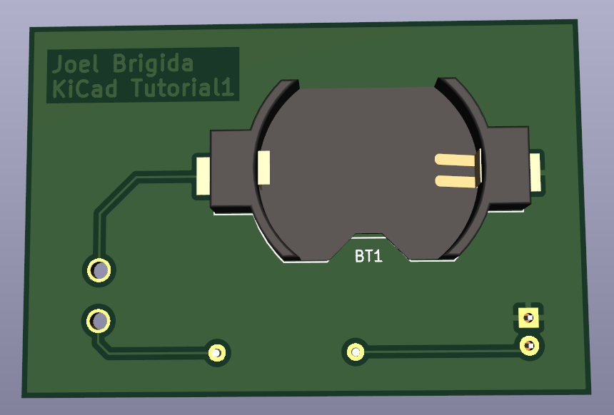

# Tutorial 1

This tutorial can be found in the `help` -> `Getting Started With KiCad` menu in the Schematic Editor of
KiCad.

This small tutorial covers schematic building, PCB layout, symbol & library creation, and 3D rendering.
The KiCad files are arranged in the default manner.

<small>
    Schematic for Tutorial 1 
</small>

<small>
    Top of PCB Design 
</small>

<small>
    Bottom of PCB Design 
</small>

