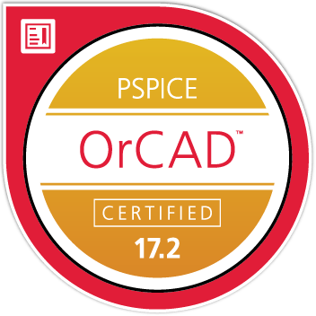

# VLSI | SPICE | PCBs | Schematics

This is a collection of similar items I needed for for Project Research. Topics range from KiCad schematics and PCB development, to PSPice and Circuit Development, and finally for VLSI design there is EDA Playground and LTSpice.

## PSPice (OrCad Capture CIS Lite)

 
<small>
    <a href="https://images.credential.net/design/8c38784e-2876-4716-bcb7-410ce74f59a4_cdeb97702cf0af1b945a1f67f94d342daf939b3ef803c20f48b01d3a5cbbe769.png">Image Source</a>
</small>

- Download OrCad Capture CIS Lite 17.2 [Here](https://archive.org/details/data2_202303) or [Here](https://archive.org/details/17.2-or-cad-lite-capture-pspice). 
    - Note that this is the license-free (Lite) version & is posted in the public domain. It does not require a license key or activation. Please use responsibly.

## EasyEDA

 
<small>
<a href="https://cdn.sparkfun.com/assets/home_page_posts/6/9/0/6/easyeda.png">Image Source</a>
</small>

- [Download EasyEDA](https://www.analog.com/en/resources/design-tools-and-calculators/ltspice-simulator.html)
- The Free Version is sufficient for entry-level projects.
- SparkFun [EasyEDA Tutorial](https://www.sparkfun.com/news/6906?hss_channel=fbp-153488801415) for PCB design.
- Easy EDA Std Version allows local storage of project files and is free.

## KiCAD

 
<small><a href="https://www.eurocircuits.com/wp-content/uploads/KiCad-Logo1.png">Image Source</a></small>

Some useful KiCad Tutorials:
- Shawn Hymel: [KiCAD Tutorial](https://www.youtube.com/playlist?list=PLEBQazB0HUyR24ckSZ5u05TZHV9khgA1O) Playlist.
- Chris Gammel: [Getting To Blinky KiCad Tutorial Series](https://www.youtube.com/watch?v=iTyi3RvNoB0&list=PLy2022BX6Esr6yxwDzhqYZyuuenJE2s5B)
- Chris Gammel: [Getting To Blinky 5.0](https://www.youtube.com/watch?v=BVhWh3AsXQs&list=PLy2022BX6EspFAKBCgRuEuzapuz_4aJCn)
- element14 presents: [Episode 485: How to Make a Custom PCB From Design to Assembly](https://www.youtube.com/watch?v=p6Fc1ep98VI) .

Official KiCad Links:

- [KiCAD Learning Resources](https://www.kicad.org/help/learning-resources/) page with tutorials.
- [KiCAD Docs](https://docs.kicad.org/)
- [KiCAD Forum](https://forum.kicad.info/)

## EDA Playground

 
<small>
    <a href="https://avatars3.githubusercontent.com/u/11648029?s=400&v=4">Image Source</a>
</small>

- [Online IDE](https://www.edaplayground.com/)
- [Quick Start](https://eda-playground.readthedocs.io/en/latest/quick-start.html) Docs
- [GitHub Repo](https://github.com/edaplayground/eda-playground)

## LTSpice

 
<small>
    <a href="https://i.pinimg.com/736x/b3/89/7f/b3897ffd382384c4323667172d76e659.jpg">Image Source</a>
</small>

- [Download LTSpice](https://www.analog.com/en/resources/design-tools-and-calculators/ltspice-simulator.html)
- 3 Video [LTSpice Tutorial for Beginners](https://www.analog.com/en/resources/media-center/videos/video-series/ltspice-getting-started-tutorial.html) by Analog Devices.
    - Also see additional tutorials by Analog Devices in these playlists:
    - 7 Video [LTSpice Essentials Tutorial](https://www.analog.com/en/resources/media-center/videos/video-series/ltspice-essentials-tutorial.html)
    - 4 Video [How to Use LTspice for AC & Noise Analysis](https://www.analog.com/en/resources/media-center/videos/video-series/ltspice-ac-noise-analysis-tutorial.html)
    - Article [Get Up and Running with LTspice](https://www.analog.com/en/resources/analog-dialogue/articles/get-up-and-running-with-ltspice.html)

## Status:

